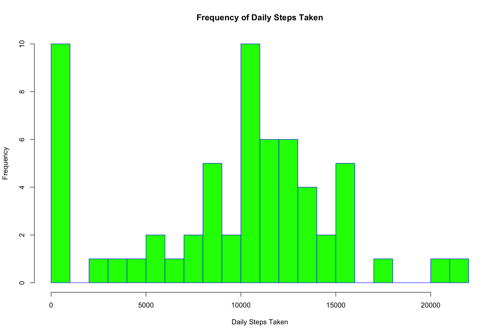
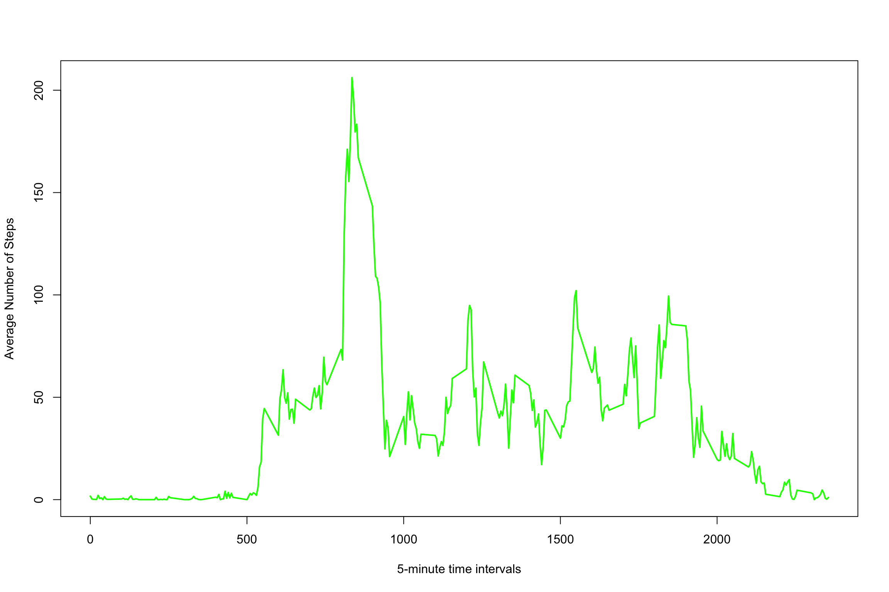
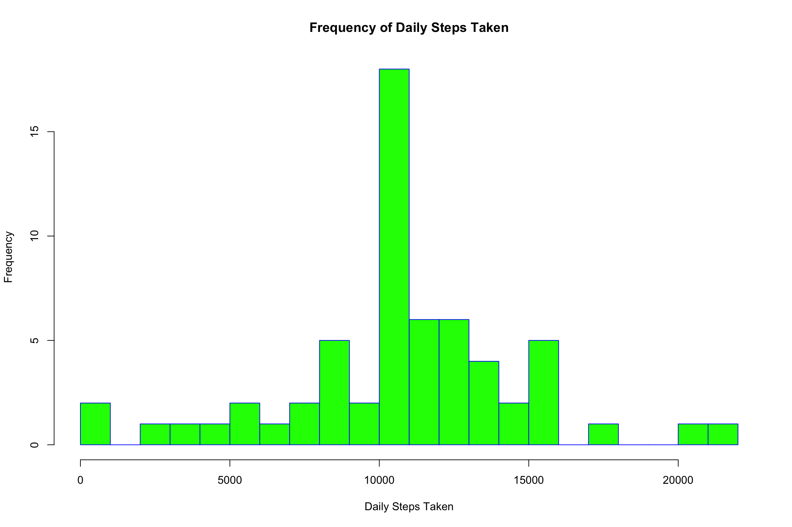
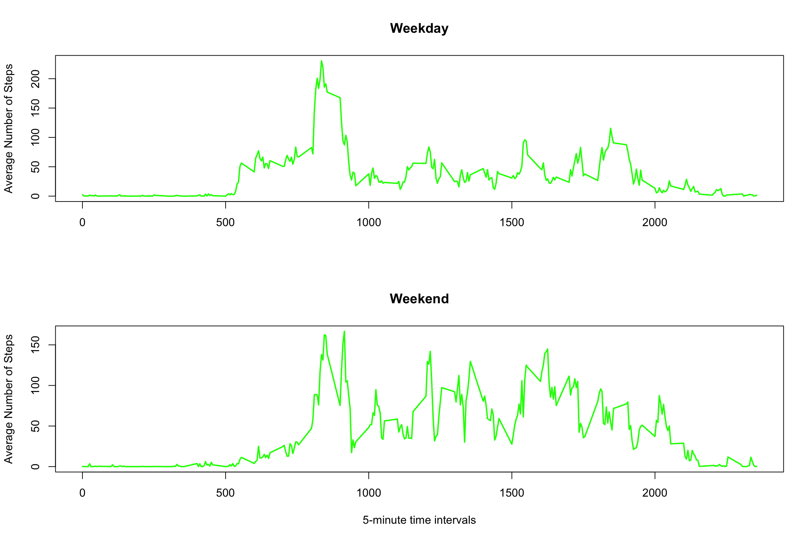

This is an R Markdown document for Project 1 of the Reproducible Research Course. 


###Loading and preprocessing the data


###What is mean total number of steps taken per day? 
For this analysis, missing values are ignored.

####Histogram of the total number of steps taken each day


```r
stepsum<-data.table(aggregate(mydata$steps, 
                    by=list(Category=mydata$date), 
                    FUN=sum, 
                    na.rm=TRUE))
hist(stepsum$x, 
     main="Frequency of Daily Steps Taken", 
     xlab="Daily Steps Taken", 
     border="blue", 
     col="green",
     xlim=c(0,22000), 
     breaks=20)
```



###Calculate the mean and median total number of steps taken per day. 
        Missing Values are ignored.
        

```r
meanstep<-round(mean(stepsum$x, na.rm=TRUE),2)
medstep<-median(stepsum$x, na.rm=TRUE)
```

The mean and median total number of steps taken per day, respectively, are:

#####9354.23 and 10395


###What is the average daily activity pattern?


```r
intervalmean<-data.table(aggregate(mydata$steps, 
                    by=list(Category=mydata$interval), 
                    FUN=mean, 
                    na.rm=TRUE))

plot(intervalmean$Category,
     intervalmean$x, 
     type="l", 
     xlab= "5-minute time intervals", 
     ylab= "Average Number of Steps", 
     col="green", 
     lwd=2)
```




###Which 5-minute interval, on average across all the days in the dataset, 
###contains the maximum number of steps?


```r
maxstep<-max(intervalmean$x)
maxint<-intervalmean$Category[intervalmean$x==maxstep]
maxstep<-round(maxstep,2)
```
On average, the interval 835 has the highest number of steps (206.17 steps).

###Imputing missing values

Calculate and report the total number of missing values in the dataset (i.e. the total number of rows with NAs)


```r
missingsteps<-sum(is.na(mydata$steps))
```

There are 2304 rows of data missing values for the variable STEPS. 

###Fill in all missing values in the dataset 
The mean for the 5-minute interval to which the missing value pertains was used
to impute a value for all NAs.


```r
impute.mean <- function(x) replace(x, is.na(x), mean(x, na.rm = TRUE))
mydata2 <- ddply(mydata, ~ interval, transform, steps = impute.mean(steps))
```

###Make a histogram of the total number of steps taken each day


```r
stepsum2<-data.table(aggregate(mydata2$steps, 
                    by=list(Category=mydata2$date), 
                    FUN=sum, 
                    na.rm=TRUE))
hist(stepsum2$x, 
     main="Frequency of Daily Steps Taken", 
     xlab="Daily Steps Taken", 
     border="blue", 
     col="green",
     xlim=c(0,22000), 
     breaks=20)
```



###Calculate and report the mean and median total number of steps taken per day. 
Do these values differ from the estimates from the first part of the assignment? 
What is the impact of imputing missing data on the estimates of the total 
daily number of steps?


Before removing the NA values, the mean and median number of steps per day was
9354.23 and 10395, respectively. After imputing values for the NA's,
using the mean for the given interval, the new values were 9354.23 
and 10395, respectively. Removing the NAs increased the mean and median 
values of the total daily number of steps.

###Are there differences in activity patterns between weekdays and weekends?

Create a new factor variable in the dataset with two levels -- "weekday" and "weekend" indicating whether a given date is a weekday or weekend day.


```r
mydata2$Weekday<-isWeekday(mydata2$date, wday=1:5)
mydata2$Weekday[mydata2$Weekday=="FALSE"]<-"weekend"
mydata2$Weekday[mydata2$Weekday=="TRUE"]<-"weekday"

intervalmean2<-data.table(aggregate(mydata2$steps, 
                    by=list(Category=mydata2$interval, Category=mydata2$Weekday), 
                    FUN=mean, 
                    na.rm=TRUE))
colnames(intervalmean2) <- c("Interval","Weekday","Steps")
```

###Make a panel plot containing a time series plot (i.e. type = "l") of the 5-minute interval (x-axis) and the average number of steps taken, averaged across all weekday days or weekend days (y-axis). 



rmarkdown::render("PA1_template.Rmd", clean=FALSE)

